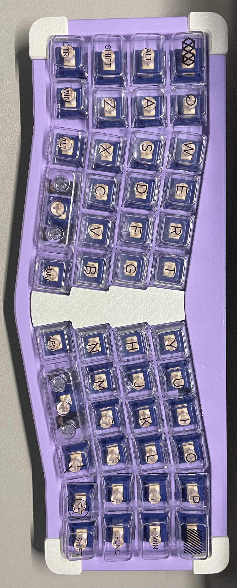

# Alik46

一个类40配列的蓝牙键盘，使用zmk固件。定位板和外壳是一体的，目前外壳支持pcb卫星轴。

# 固件地址
- [zmk固件](https://github.com/LXF-YZP/alik46)

## 元器件清单

|名称       |   数量    |购买链接                                          |
| --------------------------------- | ------ | ------------------------------------------------------------------------------------------ |
| pcb基板       |   1    | https://www.jlc.com/newOrder/#/pcb/pcbPlaceOrder                                          |
| pcb卫星轴       | 2      |                                      |
| 轴体                           | 46      |                                                                                            |
| 轴座          | 46     | 凯华轴座                                             |
| 锂电池                     | 1     |                                                                                            |
| 蓝牙芯片                | 1    | E73-2G4M08S1CX或者E73-2G4M08S1CX                                                                                   |
| 螺柱 m2x4x3.5| 4    |     |
| 蓝牙天线                   | 1     |  https://item.taobao.com/item.htm?spm=a1z09.2.0.0.67002e8dcmPRUr&id=583773660768&_u=q1hre4eh63e3                                                                                          |
| 螺丝   m2x4                | 4      |  |
|  二极管          | 46     | https://item.taobao.com/item.htm?spm=a1z09.2.0.0.70352e8dhrJ7E7&id=528155613240&_u=q1hre4eh412c                                                                        |
|  按键开关          | 1     | https://item.taobao.com/item.htm?spm=a1z09.2.0.0.70352e8dhrJ7E7&id=546724645617&_u=q1hre4eh5b12                                                                        |
|  卧贴连接器          | 1     | https://item.taobao.com/item.htm?spm=a1z09.2.0.0.70352e8dhrJ7E7&id=565715285795&_u=q1hre4eh267c                                                                        |
|  拨动开关          | 1     | https://item.taobao.com/item.htm?spm=a1z09.2.0.0.70352e8dhrJ7E7&id=557092773462&_u=q1hre4eh5b2e                                                                        |
|  超薄卧贴端子          | 1     | https://item.taobao.com/item.htm?spm=a1z09.2.0.0.67002e8dcmPRUr&id=671868863106&_u=q1hre4eh5865                                                                        |

## 外壳打印
- 自己使用3D打印机进行打印，由于外壳不存在太多曲面，所以支撑部分不用很复杂。本人使用拓竹A1打印，效果不错。

- 在未来工厂进行下单打印。

- 在三维猴进行下单打印。

- 在客制化群里面花钱请老哥进行代打或者咸鱼花钱请代打。

# 构建指南

_具体构建指南请参考B站视频讲解_

